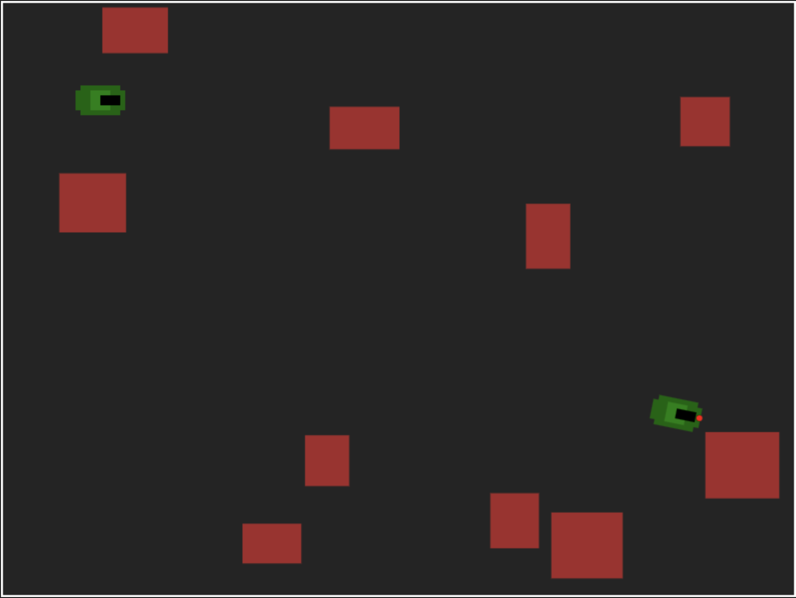

# Tank game


## Main deps


## Project structure

```
tank-game/
├── public/             # Static files
├── src/                # Source code
│   ├── components/     # React components
│   ├── game/           # Game logic (tanks, bullets, explosions, obstacles, etc.)
│   ├── App.tsx         # Main application component
│   └── main.tsx        # Entry point
├── index.html          # HTML template
└── vite.config.ts      # Vite configuration
```

## Features

- Control the tank using the arrow keys.
- Ability to shoot at the enemy.
- A bot with artificial intelligence that moves and shoots.
- Obstacles on the map that are randomly generated.
- Animation of an explosion when a tank is destroyed.
- Visually highlighted edges of the map.

## Controls

- Arrows up/down — move forward/backward.
- Arrows left/right — turn the tank.
- Space — shoot.

## Quick start

1. Install all dependencies using `yarn` or `npm install`
2. Start the development server using `yarn dev` or `npm run dev`
3. Open up [http://localhost:3000](http://localhost:3000)

## License

[MIT](https://github.com/FreeeeZ/tank-game/blob/main/LICENSE)

Copyright (c) 2025, Shell Vladislav